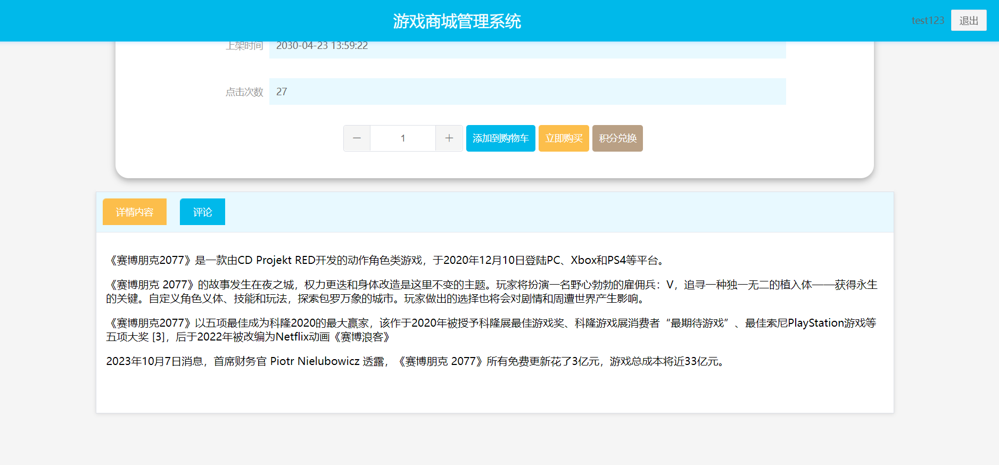

# 基于SpringBoot+Vue的游戏商城管理系统 

（源代码+12000字文档+ppt）

## 项目简介

游戏商城管理系统分为用户端和管理端。 
管理端是给管理员使用，可以对游戏种类、游戏商品信息、游戏资讯、轮播图等进行维护，并且可以对用户发表的帖子和留言进行审核和回复。还可以对用户下的订单进行发货操作。 
用户端是给用户使用，可以查看游戏资讯信息以及最新的游戏商品信息，将喜欢的游戏加入购物车下单购买，收货后不满意还支持退货操作。同时还可以在论坛和其他玩家进行交流。 
本系统采用前后端分离的开发模式，前端使用vue框架，后端使用springboot框架。数据库使用的是mysql数据库。 
该系统功能完善，界面美观，非常适合作为毕设或者课程作业以及新手开发学习。 

## 视频介绍
<a href="https://www.bilibili.com/video/BV1iipdeKEd8/?spm_id_from=333.999.0.0" target="_blank">点击查看B站视频介绍</a>

## 功能介绍
 

## 技术服务

## 系统图片
#### 1.游戏推荐
 
#### 2.游戏展示
 
#### 3.查看游戏详情
 
#### 4.添加购物车
 
#### 5.我的订单
 
#### 6.游戏论坛
 
#### 7.游戏资讯
 
#### 8.游戏信息管理
 
#### 9.订单管理
 
#### 10.游戏资讯管理
 
